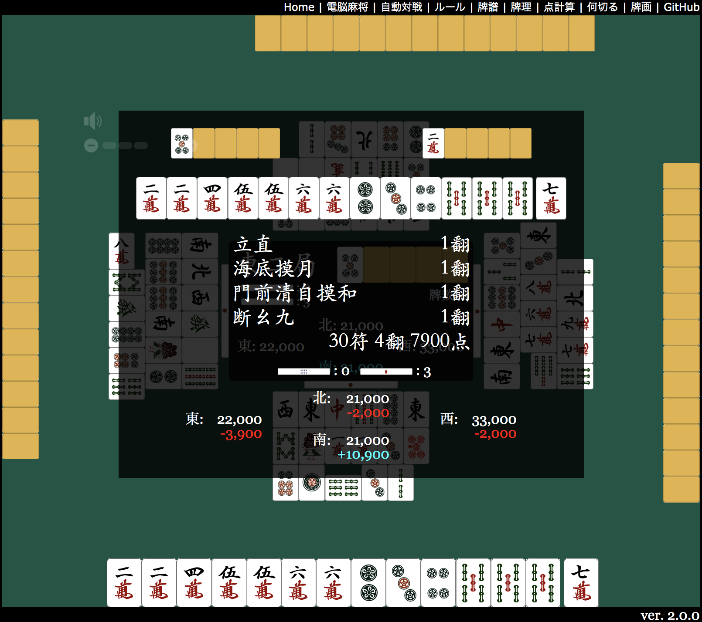

<h1></h1>

使用 HTML5 + JavaScript 运行的麻将应用「电脑麻将」

## 在线演示
https://kobalab.net/majiang/

## 许可证
[MIT](https://github.com/kobalab/Majiang/blob/master/LICENSE)

## 作者
[Satoshi Kobayashi](https://github.com/kobalab)

## npm 脚本
| 命令          | 说明
|:--------------|:-------------------------------------------
| ``release``   | 为发布构建。
| ``build``     | 为调试构建。
| ``build:js``  | 仅构建 JavaScript（调试模式）。
| ``build:css`` | 仅构建 CSS。
| ``build:html``| 仅构建 HTML。

## 子包
本项目使用以下子包构成。

### majiang-core
 - GitHub: https://github.com/kobalab/majiang-core
 - npm: @kobalab/majiang-core

包含手牌操作、听牌数・和了点计算、局进行・桌信息管理、思考程序雏形的基本类群。

### majiang-ai
 - GitHub: https://github.com/kobalab/majiang-ai
 - npm: @kobalab/majiang-ai

麻将 AI 及其开发工具。
AI 是 majiang-core 中 Majiang.Player 类的具体实现。

### majiang-ui
 - GitHub: https://github.com/kobalab/majiang-ui
 - npm: @kobalab/majiang-ui

实现手牌显示、盘面显示、牌谱再生等画面显示及与用户交互的类群。

### tenhou-url-log
 - GitHub: https://github.com/kobalab/tenhou-url-log
 - npm: @kobalab/tenhou-url-log

将电脑麻将的牌谱转换为网络麻将 [天凤](https://tenhou.net) 的[JSON 格式牌谱](https://tenhou.net/6/)(各种 AI 分析的事实标准格式) 的功能。

## 相关包
此外还有以下相关包。

### majiang-server
 - GitHub: https://github.com/kobalab/majiang-server
 - npm: @kobalab/majiang-server

WebSocket 麻将服务器实现。
电脑麻将的网络对战通过连接本服务器实现。

### majiang-analog
 - GitHub: https://github.com/kobalab/majiang-analog
 - npm: @kobalab/majiang-analog

牌谱分析工具。
提供分析电脑麻将格式牌谱的基类。
创建本类的子类，可以编写分析程序。

### tenhou-log
 - GitHub: https://github.com/kobalab/tenhou-log
 - npm: @kobalab/tenhou-log

将网络麻将 [天凤](https://tenhou.net) 的牌谱转换为电脑麻将格式。
利用本包可以解析和再生天凤的牌谱。
电脑麻将牌谱 view 的天凤牌谱再生通过连接本服务器实现。

## 相关书籍

出版了解说电脑麻将程序的书籍。
 - [对战型麻将游戏 AI 的算法与实装](https://www.amazon.co.jp/dp/4798067881)

书籍中讲解了子包 [majiang-core](#majiang-core) 和 [majiang-ai](#majiang-ai)。

## 博客文章

书籍出版后 (ver.2.0.0 以后) 的信息 (括号内为撰写时的版本)。

- 思考程序
  - [打牌选择算法 (10) 〜 剩余牌数的正规化](https://blog.kobalab.net/entry/2025/07/26/204059)
  - [推Pull 算法的改善 (4) 〜 推 Pull 阈值的再调整](https://blog.kobalab.net/entry/2025/07/27/221043)
  - [牌的危险度计算算法 (5) 〜 危险度阈值的再调整](https://blog.kobalab.net/entry/2025/07/29/074139)
- 牌谱编辑器
  - [牌谱编辑器的使用方法](https://blog.kobalab.net/entry/2024/10/28/000539) (v2.4)
  - [用电脑麻将制作 NAGA 分析用数据](https://blog.kobalab.net/entry/2024/11/02/223910) (v2.4)
- 麻将服务器
  - [麻将服务器的使用方法](https://blog.kobalab.net/entry/2024/02/15/081605) (v2.3)
  - [用 Passport 实现外部认证](https://blog.kobalab.net/entry/2024/02/19/211526) (v2.3)
  - [网络对战的持有时间设置方法](https://blog.kobalab.net/entry/2024/02/17/120315) (v2.3)
  - [麻将 Bot 的实现](https://blog.kobalab.net/entry/2025/01/20/205434) (v2.4)
  - [伪 Lag 的实现](https://blog.kobalab.net/entry/2025/01/26/194556) (v2.4)
- 点数计算练习
  - [电脑麻将 ver.2.2.0 公开#点数计算练习](https://blog.kobalab.net/entry/2023/12/24/220847#%E7%82%B9%E6%95%B0%E8%A8%88%E7%AE%97%E3%83%89%E3%83%AA%E3%83%AB) (v2.2)
  - [麻将的点数计算方法 (正式版・简易版)](https://blog.kobalab.net/entry/2023/12/11/204103) (v2.2)
- 牌谱分析・统计
  - [天凤凤凰卓统计 (2023 年)](https://blog.kobalab.net/entry/2024/11/04/215201) (v2.4)
  - [天凤凤凰卓的最高・最大・最长记录](https://blog.kobalab.net/entry/2024/11/27/034233) (v2.4)
  - [立直宣言牌的筋危险？](https://blog.kobalab.net/entry/2021/11/19/201332) (v2.0)
  - [Soba 点・里筋危险？](https://blog.kobalab.net/entry/2021/11/21/121835) (v2.0)
  - [Double 立直的好形率・和了率・平均打点？](https://blog.kobalab.net/entry/2022/03/19/124607) (v2.0)
  - [评价牌的危险度决定算法](https://blog.kobalab.net/entry/2025/06/15/101229) (v2.4)
  - [评价牌的危险度决定算法 (2)](https://blog.kobalab.net/entry/2025/07/05/033429) (v2.4)
  - [评价「山读」算法](https://blog.kobalab.net/entry/2025/06/26/224529) (v2.4)
- 模拟
  - [麻将 AI 的制作方法](https://blog.kobalab.net/entry/2025/02/20/010020) (v2.4)
  - [模拟不吃麻雀对成绩的影响](https://blog.kobalab.net/entry/2025/02/28/203123) (v2.4)
  - [模拟禁止立直的影响](https://blog.kobalab.net/entry/2025/03/06/214245) (v2.4)
  - [验证 Combo 理论的有用性](https://blog.kobalab.net/entry/2025/05/30/224039) (v2.4)
  - [模拟 Dama 听的效果](https://blog.kobalab.net/entry/2025/06/20/203242) (v2.4)
- 算法・其他
  - [用 Backtrack 求麻将和了形一览](https://blog.kobalab.net/entry/2024/09/16/111847) (v2.3)
  - [输出麻将「待」的程序](https://blog.kobalab.net/entry/2022/05/01/181217) (v2.0)
  - [麻将应用调试可用的牌姿](https://blog.kobalab.net/entry/2022/04/17/174206) (v2.0)

## (旧) 博客文章

过去的博客文章。
内容有些旧。
ver.2.0.0 的程序信息请参阅 [书籍](#书籍)。
括号内为撰写时的版本。

- 程序构成
  - [电脑麻将的程序构成 (0) 〜 整体篇](https://blog.kobalab.net/entry/2020/07/19/212824) (v1.4)
  - [电脑麻将的程序构成 (1) 〜 JavaScript 篇](https://blog.kobalab.net/entry/2020/07/24/234523) (v1.4)
  - [电脑麻将的程序构成 (2) 〜 HTML/CSS 篇](https://blog.kobalab.net/entry/2020/07/29/003536) (v1.4)
- 手牌等数据结构
  - [麻将手牌的 Javascript 表现](https://blog.kobalab.net/entry/20151211/1449838875) (v0.2)
  - [麻将手牌的字符串表现](https://blog.kobalab.net/entry/20151218/1450441130) (v0.2)
  - [牌山与河的数据结构](https://blog.kobalab.net/entry/2020/09/23/201841) (v1.4)
  - [电脑麻将的牌谱格式](https://blog.kobalab.net/entry/20151228/1451228689) (v0.3)
- 听牌数计算
  - [求向聴数的程序 (七对子・国士无双篇)](https://blog.kobalab.net/entry/20151215/1450112281) (v0.2)
  - [求向聴数的程序 (一般手篇 (再))](https://blog.kobalab.net/entry/20151216/1450191666) (v0.2)
  - [求向聴数的程序 (一般手篇 (再々))](https://blog.kobalab.net/entry/20151217/1450357254) (v0.2)
  - [求向聴数的程序 (修正版)](https://blog.kobalab.net/entry/20170917/1505601161) (v0.9)
- 和了点计算
  - [计算麻将和了点的程序](https://blog.kobalab.net/entry/20151221/1450624780) (v0.3)
  - [麻将和了点计算 〜 状况役与悬赏役一览制作](https://blog.kobalab.net/entry/20151222/1450710990) (v0.3)
  - [求和了形的程序 (特殊形)](https://blog.kobalab.net/entry/20151223/1450796906) (v0.3)
  - [求和了形的程序 (一般形)](https://blog.kobalab.net/entry/20151224/1450883400) (v0.3)
  - [求麻将符的程序](https://blog.kobalab.net/entry/20151225/1450970516) (v0.3)
  - [判定麻将役的程序 (再)](https://blog.kobalab.net/entry/20151226/1451057134) (v0.3)
  - [计算麻将和了点的程序 (最终回)](https://blog.kobalab.net/entry/20151227/1451142872) (v0.3)
- 游戏进行
  - [麻将局进行的程序方式](https://blog.kobalab.net/entry/20151229/1451315733) (v0.3)
  - [麻将局进行的程序实装](https://blog.kobalab.net/entry/20151230/1451403553) (v0.3)
  - [麻将局进行的状态迁移](https://blog.kobalab.net/entry/20151231/1451487890) (v0.3)
  - [麻将规则的自定义 (0) 〜 规则一览](https://blog.kobalab.net/entry/2021/05/01/091041) (v2.0)
  - [麻将规则的自定义 (1) 〜 终局判断与积分计算](https://blog.kobalab.net/entry/2021/05/05/165116) (v2.0)
  - [麻将规则的自定义 (2) 〜 流局处理与连庄判断](https://blog.kobalab.net/entry/2021/05/11/070443) (v2.0)
  - [麻将规则的自定义 (3) 〜 赤牌与ドラ](https://blog.kobalab.net/entry/2021/12/13/213403) (v2.0)
  - [麻将规则的自定义 (4) 〜 和了役与点计算](https://blog.kobalab.net/entry/2021/12/15/064735) (v2.0)
  - [麻将规则的自定义 (5) 〜 打牌制约](https://blog.kobalab.net/entry/2021/12/17/013546) (v2.0)
- 思考程序
  - [麻将 AI 的程序结构](https://blog.kobalab.net/entry/20160102/1451703115) (v0.4)
  - [麻将的打牌选择算法 (1)](https://blog.kobalab.net/entry/20160103/1451781343) (v0.4)
  - [麻将的打牌选择算法 (2)](https://blog.kobalab.net/entry/20160104/1451907283) (v0.4)
  - [麻将的打牌选择算法 (3)](https://blog.kobalab.net/entry/20160105/1451998413) (v0.4)
  - [Betari 折算法](https://blog.kobalab.net/entry/20161204/1480808089) (v0.5)
  - [麻将的副露判断算法 (1)](https://blog.kobalab.net/entry/20161212/1481471543) (v0.6)
  - [麻将的副露判断算法 (2)](https://blog.kobalab.net/entry/20161213/1481557260) (v0.6)
  - [麻将的副露判断算法 (3)](https://blog.kobalab.net/entry/20161214/1481644278) (v0.6)
  - [麻将的副露判断算法 (4)](https://blog.kobalab.net/entry/20161215/1481809226) (v0.6)
  - [麻将的打牌选择算法 (4)](https://blog.kobalab.net/entry/20170731/1501502063) (v0.9)
  - [麻将的打牌选择算法 (5)](https://blog.kobalab.net/entry/20170802/1501673312) (v0.9)
  - [麻将的打牌选择算法 (6)](https://blog.kobalab.net/entry/20170806/1502026197) (v0.9)
  - [麻将的打牌选择算法 (7)](https://blog.kobalab.net/entry/20170813/1502605785) (v0.9)
  - [麻将的打牌选择算法 (8)](https://blog.kobalab.net/entry/20170819/1503150574) (v0.9)
  - [麻将的副露判断算法 (5)](https://blog.kobalab.net/entry/20170822/1503401216) (v0.9)
  - [麻将的打牌选择算法 (9)](https://blog.kobalab.net/entry/20170826/1503705167) (v0.9)
  - [推 Pull 表的牌姿是评价值几点？](https://blog.kobalab.net/entry/2020/12/09/002002) (v1.5)
  - [推 Pull 算法的改善 (1)](https://blog.kobalab.net/entry/2020/12/21/202933) (v1.5)
  - [推 Pull 算法的改善 (2)](https://blog.kobalab.net/entry/2020/12/25/205627) (v1.5)
  - [推 Pull 算法的改善 (3)](https://blog.kobalab.net/entry/2021/01/02/163535) (v1.5)
  - [天凤凤凰卓的牌的危险度表](https://blog.kobalab.net/entry/2021/01/16/130716) (v1.6)
  - [牌的危险度计算算法 (1)](https://blog.kobalab.net/entry/2021/01/22/204805) (v1.6)
  - [牌的危险度计算算法 (2)](https://blog.kobalab.net/entry/2021/10/28/232300) (v1.6)
  - [牌的危险度计算算法 (3)](https://blog.kobalab.net/entry/2021/11/15/080258) (v1.6)
  - [牌的危险度计算算法 (4)](https://blog.kobalab.net/entry/2021/11/22/071442) (v1.6)
- 显示处理
  - [电脑麻将中的 MVC 实装](https://blog.kobalab.net/entry/2021/03/25/205151) (v1.5)
  - [显示麻将手牌的程序](https://blog.kobalab.net/entry/2020/08/14/234729) (v1.4)
- 其他
  - [电脑麻将程序中的中国语一览](https://blog.kobalab.net/entry/20170722/1500688645) (v0.8)
  - [解析天凤的牌谱格式 (1)](https://blog.kobalab.net/entry/20170225/1488036549) (v0.8)
  - [解析天凤的牌谱格式 (2)](https://blog.kobalab.net/entry/20170228/1488294993) (v0.8)
  - [解析天凤的牌谱格式 (3)](https://blog.kobalab.net/entry/20170312/1489315432) (v0.8)
  - [解析天凤的牌谱格式 (4)](https://blog.kobalab.net/entry/20170720/1500479235) (v0.8)
  - [天凤统计 (1) 〜 基础信息与和了役・流局理由](https://blog.kobalab.net/entry/20180113/1515776231) (v0.9)
  - [天凤统计 (2) 〜 巡目别的向聴数・立直率・和了率](https://blog.kobalab.net/entry/20180118/1516202840) (v0.9)
  - [天凤统计 (3) 〜 局结束时的牌分布](https://blog.kobalab.net/entry/20180119/1516290844) (v0.9)
  - [天凤统计 (4) 〜 待牌分布](https://blog.kobalab.net/entry/20180120/1516417938) (v0.9)
  - [天凤统计 (5) 〜 巡目别的副露数・副露时向聴数](https://blog.kobalab.net/entry/20180203/1517667551) (v0.9)
  - [何切る检讨 (0) 〜 打牌选择算法](https://blog.kobalab.net/entry/2019/06/09/130640) (v1.1)
  - [何切る检讨 (1) 〜 好牌先打？](https://blog.kobalab.net/entry/2019/09/24/211843) (v1.3)
  - [何切る检讨 (2) 〜 与 Chiitoi 的权衡](https://blog.kobalab.net/entry/2019/10/03/120150) (v1.3)
  - [何切る检讨 (3) 〜 手变化的考虑](https://blog.kobalab.net/entry/2019/10/05/122646) (v1.3)
  - [何切る检讨 (4) 〜 待八等待！](https://blog.kobalab.net/entry/2019/10/06/082947) (v1.3)
  - [何切る检讨 (5) 〜 鸣的评价](https://blog.kobalab.net/entry/2019/10/07/001354) (v1.3)
  - [何切る检讨 (6) 〜 良形听牌？](https://blog.kobalab.net/entry/2019/10/08/001841) (v1.3)
  - [何切る检讨 (7) 〜 片 Agari 不行？](https://blog.kobalab.net/entry/2019/10/10/232937) (v1.3)
  - [牌画输入工具](https://blog.kobalab.net/entry/20161218/1482078427) (v0.7)
  - [用电脑麻将检讨天凤的牌谱](https://blog.kobalab.net/entry/2020/07/08/080228) (v1.4)
  - [Duplicate 麻雀的实装](https://blog.kobalab.net/entry/2020/12/19/075529) (v1.5)

## 致谢
游戏中使用的牌画像来自 [麻雀的画像・素材](http://www.civillink.net/fsozai/majan.html)、
音效来自 [天凤用原创 SE: 安 Koroking blog](http://ancoro.way-nifty.com/blog/se.html)。
